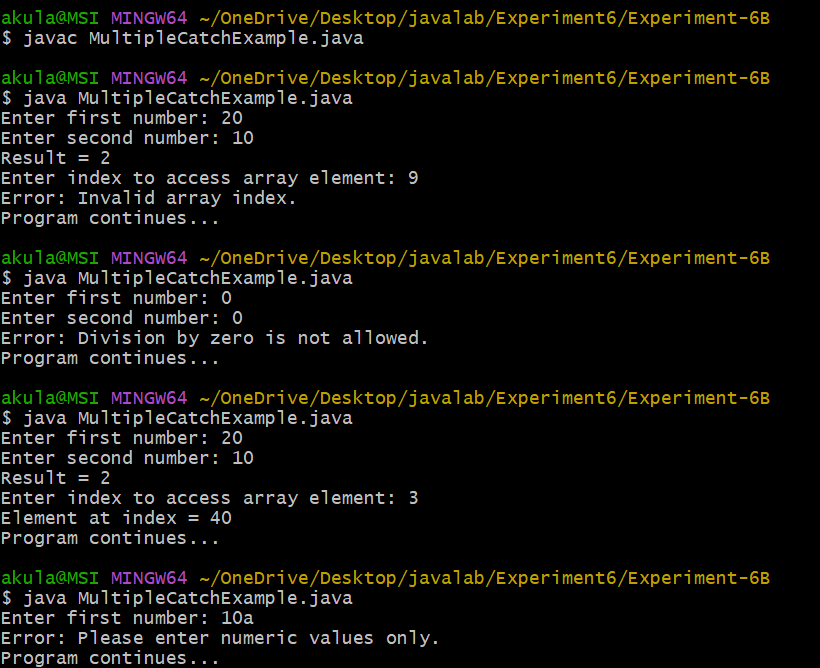
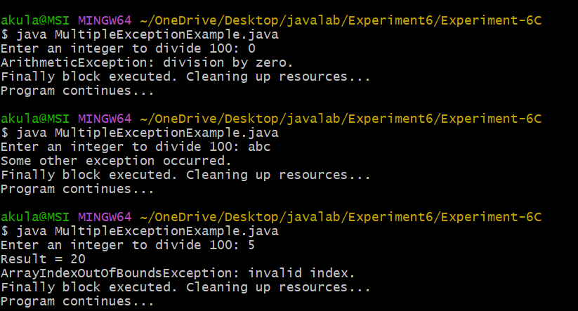

## EXPERIMENT-6
##  Experiment-6(A)
### ExceptionArray Class
```java
import java.util.Scanner;

public class ExceptionArray {

    public static void main(String[] args) {

        Scanner sc = new Scanner(System.in);

        System.out.print("Enter size of array: ");
        int n = sc.nextInt();

        int[] arr = new int[n];

        for (int i = 0; i < n; i++) {
            System.out.print("Enter element at index " + i + ": ");
            arr[i] = sc.nextInt();
        }

        System.out.print("Enter index to access: ");
        int index = sc.nextInt();

        try {
            System.out.println("Element at index " + index + " is: " + arr[index]);
        }
        catch (ArrayIndexOutOfBoundsException e) {
            System.out.println("Invalid index! Please enter index between 0 and " + (n - 1));
        }

        sc.close();
    }
}
```

OUTPUT:


##  Experiment-6(B)
### MultipleCatchExample Class
```java
import java.util.Scanner;
import java.util.InputMismatchException;

public class MultipleCatchExample {

    public static void main(String[] args) {

        Scanner sc = new Scanner(System.in);

        int[] arr = {10, 20, 30, 40, 50};

        try {

            System.out.print("Enter first number: ");
            int a = sc.nextInt();

            System.out.print("Enter second number: ");
            int b = sc.nextInt();

            int result = a / b;
            System.out.println("Result = " + result);

            System.out.print("Enter index to access array element: ");
            int index = sc.nextInt();

            System.out.println("Element at index = " + arr[index]);
        }

        catch (ArithmeticException e) {
            System.out.println("Error: Division by zero is not allowed.");
        }

        catch (InputMismatchException e) {
            System.out.println("Error: Please enter numeric values only.");
        }

        catch (ArrayIndexOutOfBoundsException e) {
            System.out.println("Error: Invalid array index.");
        }

        catch (Exception e) {
            System.out.println("Some other error occurred.");
        }

        System.out.println("Program continues...");

        sc.close();
    }
}
```
OUTPUT:





##  Experiment-6(C)
### MultipleExceptionExample Class
```java
import java.util.Scanner;

public class MultipleExceptionExample {

    public static void main(String[] args) {

        Scanner sc = new Scanner(System.in);

        try {

            System.out.print("Enter an integer to divide 100: ");
            int n = sc.nextInt();

            int result = 100 / n;
            System.out.println("Result = " + result);

            int[] arr = new int[3];
            System.out.println("Accessing element: " + arr[5]);

            System.out.print("Enter a number as text: ");
            String s = sc.next();

            int num = Integer.parseInt(s);
            System.out.println("Converted number = " + num);
        }

        catch (ArithmeticException e) {
            System.out.println("ArithmeticException: division by zero.");
        }

        catch (ArrayIndexOutOfBoundsException e) {
            System.out.println("ArrayIndexOutOfBoundsException: invalid index.");
        }

        catch (NumberFormatException e) {
            System.out.println("NumberFormatException: invalid numeric format.");
        }

        catch (Exception e) {
            System.out.println("Some other exception occurred.");
        }

        finally {
            System.out.println("Finally block executed. Cleaning up resources...");
            sc.close();
        }

        System.out.println("Program continues...");
    }
}
```
OUTPUT:



